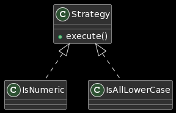
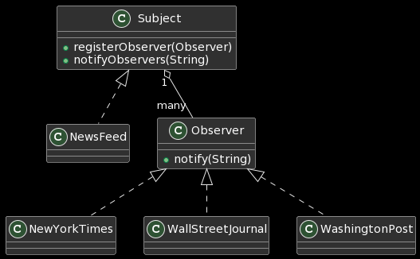
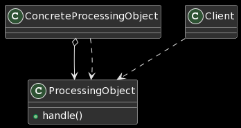

# Design Patterns in Java

Blueprints for software design solutions.

---

## [Strategy](Strategy)



Represent a set of algorithms and choose one at runtime.

* Notes:
  * lamba expressions avoid unneccessary boilerplate code

```java
// 🚫 old school: IsNumeric class implements Validator interface
Validator numericValidator = new Validator(new IsNumeric());
assert(numericValidator.validate("123") == true);
assert(numericValidator.validate("abc") == false);

// 🚫 old school: IsAllLowerCase class implements Validator interface
Validator lowerCaseValidator = new Validator(new IsAllLowerCase());
assert(lowerCaseValidator.validate("abc") == true);
assert(lowerCaseValidator.validate("ABC") == false);

// ✅ new school: lamba expressions can more concisely encapsulate code
Validator numericValidator2 = new Validator((String s) -> s.matches("\\d+"));
assert(numericValidator2.validate("123") == true);
assert(numericValidator2.validate("abc") == false);

// ✅ new school: lamba expressions can more concisely encapsulate code
Validator lowerCaseValidator2 = new Validator((String s) -> s.matches("[a-z]+"));
assert(lowerCaseValidator.validate("abc") == true);
assert(lowerCaseValidator.validate("ABC") == false);
```

## [Template Method](Template)

Outline an algorithm's steps and customize each steps' implemetation details.

```java
public void process() {
    start();
    work();
    finish();
}
å
Baker baker = new Baker();
baker.process();
/*
 * Preheat oven
 * Gather recipe books
 * Prepare ingedients
 * Chop ingredients
 * Mix ingredients
 * Place ingredients in a cooking container
 * Place cooking contains in oven
 * Set baking timer
 * Remove from oven and let cooking container cool down
 * Place food onto plates on the dinner table
 * Ring dinner bell
 */

Engineer engineer = new Engineer();
engineer.process();
/*
 * Analyze requirements
 * Architect software design
 * Create UML class + sequene diagrams
 * Create boilerplate code
 * Develop implementation
 * Test to validate expected behavior
 * Fix linting errors
 * Create CL and assign reviews
 * Request code review
 * Address code review feedback
 * Commit software changes
 */
```

## [Observer](Observer)



The subject notifies observers.

```java
NewsFeed feed = new NewsFeed();
List<Observer> newspapers = Arrays.asList(
    new WallStreetJournal(),
    new NewYorkTimes(),
    new WashingtonPost());
newspapers.forEach(feed::registerObserver);
feed.notifyObservers("Trump knows o'doyle rules");
feed.notifyObservers("Free pizza in downtown Manhattan");
feed.notifyObservers("Jeff Bezos owns the Washington Post");
/*
 * WSJ exclusive! Trump knows o'doyle rules
 * New York Times: Free pizza in downtown Manhattan
 * The Washington Post: Jeff Bezos owns the Washington Post
 */

// lambda expressions
feed.registerObserver((String s) -> {
    if (s.contains("sale"))
        System.out.println("Sale! " + s);
});
feed.notifyObservers("Puppies for sale");
feed.notifyObservers("Garage sale this weekend");
feed.notifyObservers("All grassfeed beef is on sale");
/*
 * Sale! Puppies for sale
 * Sale! Garage sale this weekend
 * Sale! All grassfeed beef is on sale
 */
```

## [Chain of Responsibility](ChainOfResponsibility)



Create a chain of processing objects.

```java
ProcessingObject<String> titleCase = new TitleCase();
ProcessingObject<String> exclamationMark = new ExclamationMark();
titleCase.setSuccessor(exclamationMark);
String input = "howdy there partner";
String output = titleCase.handle(input);
System.out.println(output);
/*
 * Howdy there partner!
 */

// lambdas
UnaryOperator<String> titleCase = (String s) -> s.length() == 0 ? "" : s.substring(0, 1).toUpperCase() + s.substring(1);
UnaryOperator<String> exclamationMark = (String s) -> s + "!";
Function<String, String> pipeline = titleCase.andThen(exclamationMark);
String output = pipeline.apply(input);
System.out.println(output);
```