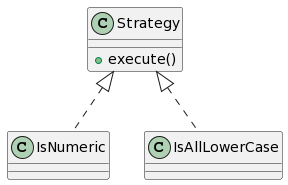

# Design Patterns in Java

Blueprints for software design solutions.

---

## [Strategy](Strategy)



Represent a set of algorithms and choose one at runtime.

* Notes:
  * lamba expressions avoid unneccessary boilerplate code

```java
// 🚫 old school: IsNumeric class implements Validator interface
Validator numericValidator = new Validator(new IsNumeric());
assert(numericValidator.validate("123") == true);
assert(numericValidator.validate("abc") == false);

// 🚫 old school: IsAllLowerCase class implements Validator interface
Validator lowerCaseValidator = new Validator(new IsAllLowerCase());
assert(lowerCaseValidator.validate("abc") == true);
assert(lowerCaseValidator.validate("ABC") == false);

// ✅ new school: lamba expressions can more concisely encapsulate code
Validator numericValidator2 = new Validator((String s) -> s.matches("\\d+"));
assert(numericValidator2.validate("123") == true);
assert(numericValidator2.validate("abc") == false);

// ✅ new school: lamba expressions can more concisely encapsulate code
Validator lowerCaseValidator2 = new Validator((String s) -> s.matches("[a-z]+"));
assert(lowerCaseValidator.validate("abc") == true);
assert(lowerCaseValidator.validate("ABC") == false);
```